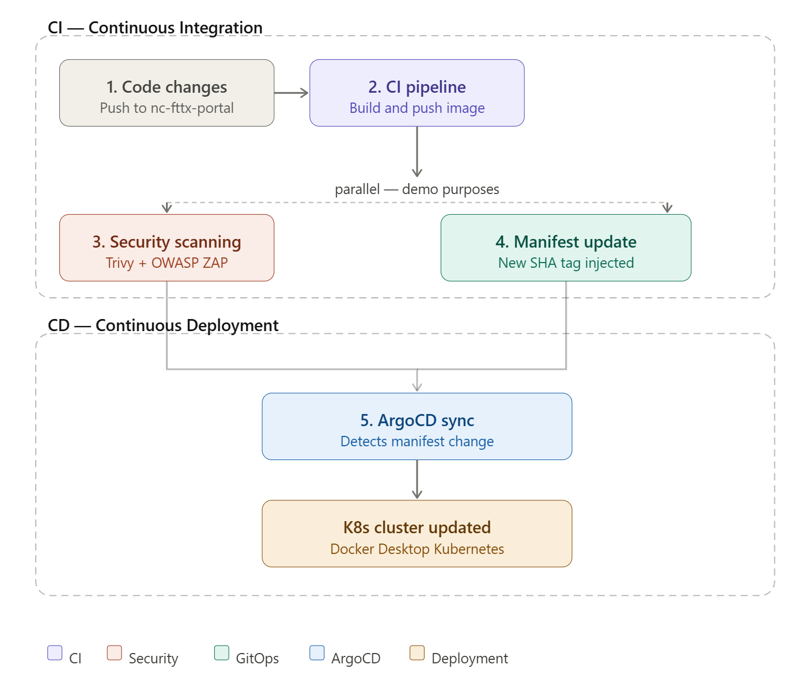
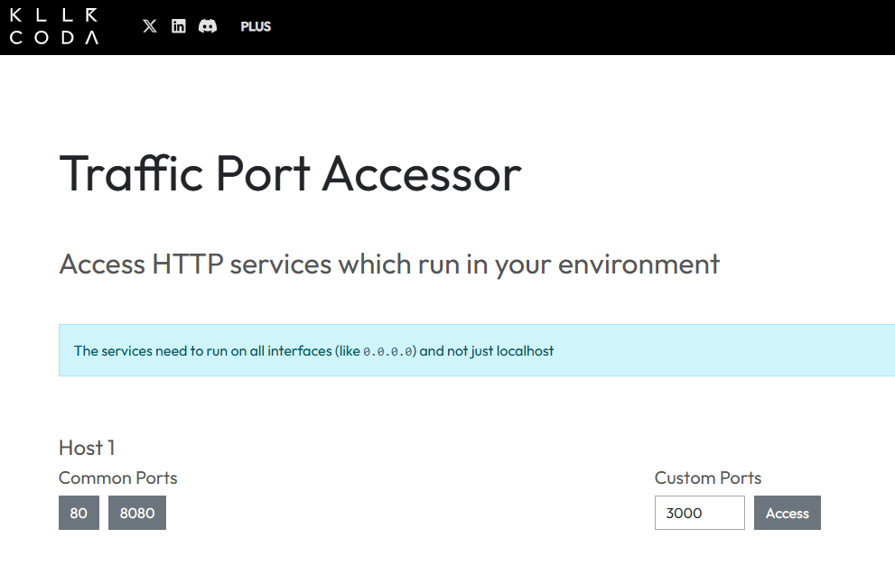
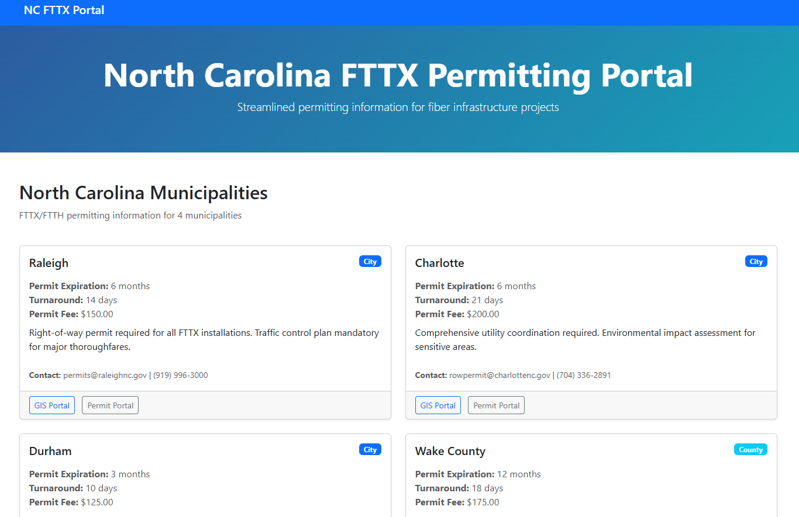

# NC FTTX Portal - GitOps (Continuous Deployment w/ K8s & ArgoCD)

## Overview
This repository contains the declarative Kubernetes manifests for the NC FTTX Portal application.

Designed as the "Source of Truth" for infrastructure state, this repository works in tandem with the associated Continuous Integration (CI) repository. Together, they provide a full-scale demonstration of modern DevOps principles—specifically GitOps workflows—using ArgoCD for automated deployment and drift detection.

## Architecture
- **Application Source**: [nc-fttx-portal](https://github.com/YOUR_USERNAME/nc-fttx-portal) repository
- **Container Registry**: Docker Hub
- **GitOps Tool**: ArgoCD
- **Target Environment**: Local Kubernetes cluster (Docker Desktop)

## Repository Structure

```
nc-fttx-portal-gitops/
├── argocd/
│   └── application.yaml      # ArgoCD Application definition
├── manifests/
│   ├── namespace.yaml        # Web App namespace
│   ├── deployment.yaml       # Kubernetes deployment
│   └── service.yaml          # Kubernetes service
└── README.md                
```

## CI/CD Work Flow

1. **Code Changes**: Developers push to `nc-fttx-portal` repository
2. **CI Pipeline**: GitHub Actions builds and pushes Docker image
3. **Security Scanning**: Trivy and OWASP ZAP validate the build (*Parallel operation for demonstration purposes*)
4. **Manifest Update**: CD pipeline updates `deployment.yaml` with new image tag
5. **ArgoCD Sync**: ArgoCD detects changes and deploys to Docker Desktop Kubernetes cluster



##  Continue to the Implementation Guide: *https://github.com/jaycloud336/nc-fttx-portal-gitops/cicd-implementation-guide-deploy.md*


# Manual Validation & Testing
If you like to quickly test this Kubernetes Cluster config in isolation for validation purposes without ArgoCD, You can validate this configuration in isolation using a local cluster or a sandbox environment (e.g., Killrshell, Play with K8s ..etc).

### Prerequisites
* **Kubernetes Cluster**: Access to a running cluster.
* **kubectl**: Configured to point to your sandbox cluster.

---

##  Quick Manual Validation (No ArgoCD)
Use this method to verify that your manifests are syntactically correct and the application starts successfully without the overhead of the GitOps controller.


### CD Repo:
https://github.com/jaycloud336/nc-fttx-portal-gitops

### 1. Clone the repository found here: 
`git clone https://github.com/jaycloud336/nc-fttx-portal-gitops)`

`cd nc-fttx-portal-gitops`

### 2. Create the application namespace
`kubectl apply -f manifests/namespace.yaml`

### 3. Deploy the application manifests directly
`kubectl apply -f manifests/`

### 4. Verify the deployment
`kubectl get all -n nc-fttx-portal`

### 5. Access the application via Port-Forward
`kubectl port-forward -n nc-fttx-portal svc/nc-fttx-portal-service 3000:80`


### If using a local cluster access the app at: 
http://localhost:3000

### If using KILLRCODA playground:

### **Use this-port forward command for killrshell environment to listen across all interfaces including the killrshell vm*:

`kubectl port-forward --address 0.0.0.0 -n nc-fttx-portal svc/nc-fttx-portal-service 3000:80`

### Go to the Traffic Port Accessor: 
Type *`3000`* in the *`Custom Ports`* field and select *`Access`* 





